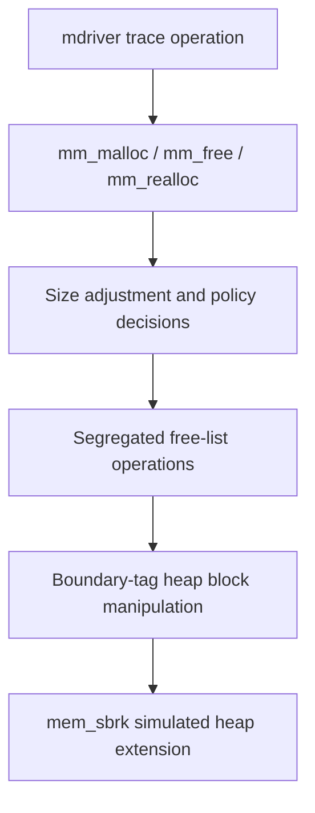
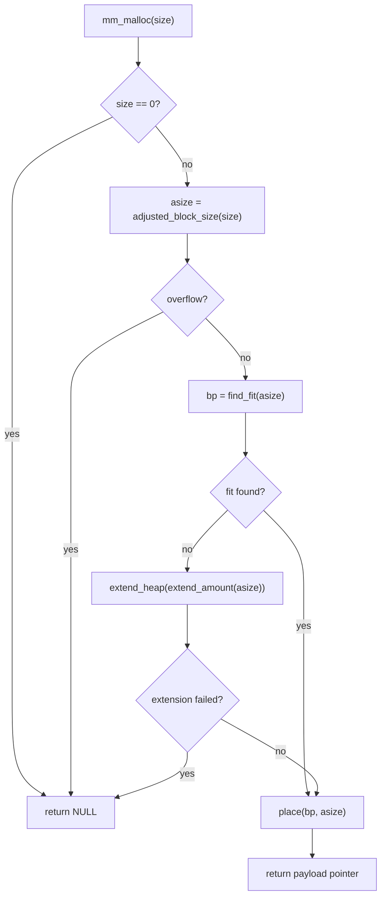

# Technical Design Document: Segregated Explicit Free-List Malloc Allocator

## 1. Executive Summary

This project implements a CS:APP malloc-lab dynamic memory allocator in
`mm.c`. The allocator exports the three functions required by the handout:

```c
int mm_init(void);
void *mm_malloc(size_t size);
void mm_free(void *ptr);
void *mm_realloc(void *ptr, size_t size);
```

The implementation is a segregated explicit free-list allocator. Every heap
block has a boundary-tag header and footer. Free blocks also use the first
two pointer-sized words in their payload as `prev` and `next` links in a
doubly linked free list. The allocator keeps 24 free lists, one per size
class, and maps every free block into exactly one list based on its block
size.

The major design goals are:

- Correctness under the malloc-lab trace driver.
- 8-byte payload alignment.
- Good utilization by splitting blocks, using segregated classes, and tuning
  heap-extension sizes.
- Good throughput by using explicit free lists, bounded best-fit search, and
  constant-time list operations.
- Strong `realloc` behavior by resizing in place whenever possible.

The allocator's most important implementation choices are:

- Header and footer on every block, including allocated blocks.
- Immediate coalescing whenever a block becomes free.
- Segregated free lists stored in static global state.
- Head insertion for newly free or newly split blocks.
- Bounded best-fit search within each size class.
- Special `realloc` fast paths for shrinking, growing into the next free
  block, growing at the epilogue, growing backward into a previous free
  block, and allocate-copy-free fallback.

## 2. Repository Context

The repository is a compact malloc-lab workspace:

```text
.
|-- Makefile          # Course build rules
|-- README.md         # User-facing repo notes
|-- config.h          # Trace directory, scoring config, alignment, heap size
|-- mdriver.c         # Course malloc driver
|-- memlib.c/.h       # Simulated heap and mem_sbrk API
|-- mm.c/.h           # Student allocator implementation and public API
|-- short1-bal.rep    # Starter trace
|-- short2-bal.rep    # Starter trace
|-- clock/fcyc/fsecs/ftimer files
```

The allocator design is shaped by three external interfaces:

1. `mm.h` defines the public allocator functions and team structure.
2. `memlib.c` provides a simulated, monotonically growing heap.
3. `mdriver.c` evaluates correctness, utilization, and throughput.

The design deliberately keeps all allocator logic in `mm.c`, which is the
hand-in file for the course Makefile.

## 3. Problem Statement

The allocator must implement `malloc`, `free`, and `realloc` semantics over a
simulated heap. It does not call the system allocator for heap blocks. Instead,
it obtains heap memory from `mem_sbrk`.

The allocator must satisfy the driver checks:

- Each returned payload pointer must be aligned to `ALIGNMENT`, which is 8 in
  `config.h`.
- Each allocated payload must lie within the current simulated heap.
- Allocated payload ranges must never overlap.
- `realloc` must preserve the first `min(old_size, new_size)` payload bytes.
- The allocator must return `NULL` for impossible requests rather than
  corrupting the heap.

The allocator is also judged on:

- Space utilization: peak live payload bytes divided by simulated heap size.
- Throughput: total trace operations per second.

## 4. Non-Goals

This design intentionally does not try to be a production libc allocator.
Several choices are appropriate for malloc lab, but would need revisiting in
a real allocator:

- It is single-threaded and has no locking.
- It uses footers on allocated blocks, increasing internal overhead.
- It does not return memory to the OS because `mem_sbrk` cannot shrink.
- It does not implement `calloc`.
- It does not expose a production `mm_checkheap` symbol to the driver.
- It includes trace-aware tuning for known malloc-lab patterns.

## 5. External Interfaces

### 5.1 Public Allocator API

`mm.h` declares the allocator entry points:

```c
extern int mm_init (void);
extern void *mm_malloc (size_t size);
extern void mm_free (void *ptr);
extern void *mm_realloc(void *ptr, size_t size);
```

The driver calls `mm_init` once per trace pass after resetting the simulated
heap. It then replays a sequence of allocation, reallocation, and free
operations.

### 5.2 Simulated Heap API

`memlib.c` models a heap with three static pointers:

```c
static char *mem_start_brk;  /* points to first byte of heap */
static char *mem_brk;        /* points to last byte of heap */
static char *mem_max_addr;   /* largest legal heap address */
```

Heap extension is performed through `mem_sbrk`:

```c
void *mem_sbrk(int incr)
{
    char *old_brk = mem_brk;

    if ( (incr < 0) || ((mem_brk + incr) > mem_max_addr)) {
        errno = ENOMEM;
        fprintf(stderr, "ERROR: mem_sbrk failed. Ran out of memory...\n");
        return (void *)-1;
    }
    mem_brk += incr;
    return (void *)old_brk;
}
```

Important implications:

- The heap only grows.
- `mem_sbrk` returns the old break pointer, which becomes the start of the new
  heap area.
- A failed extension returns `(void *)-1`.
- The allocator must not assume that memory can be released back to `memlib`.

### 5.3 Driver Trace Format

The bundled driver supports these trace operations:

```text
a index size
r index size
f index
```

The driver reads each operation into `traceop_t`:

```c
typedef struct {
    enum {ALLOC, FREE, REALLOC} type;
    int index;
    int size;
} traceop_t;
```

This repository's driver does not support newer trace operations such as
`c` heap checks or `calloc` operations.

## 6. Architecture Overview

At a high level, the allocator layers are:



The key internal helpers are:

```c
static size_t adjusted_block_size(size_t size);
static size_t extend_amount(size_t asize);
static int class_index(size_t size);
static void insert_free_block(void *bp);
static void remove_free_block(void *bp);
static void *coalesce(void *bp);
static void *extend_heap(size_t bytes);
static void *find_fit(size_t asize);
static void place(void *bp, size_t asize);
```

Each helper has a narrow responsibility:

- `adjusted_block_size`: converts requested payload bytes into an aligned
  block size with metadata overhead.
- `extend_amount`: chooses how much heap space to request when no fit exists.
- `class_index`: maps a block size to a segregated free-list index.
- `insert_free_block`: links a free block into its size class.
- `remove_free_block`: unlinks a free block from its size class.
- `coalesce`: merges a free block with adjacent free neighbors.
- `extend_heap`: obtains more heap memory and installs a new epilogue.
- `find_fit`: searches free lists for a usable block.
- `place`: marks a free block allocated and optionally splits the remainder.

## 7. Block Model

### 7.1 Block Pointer Convention

The allocator uses `bp` to mean "payload pointer", not "header pointer".
This is the same convention used in CS:APP examples. Given a payload pointer:

- The header is one word before `bp`.
- The footer is at the end of the block.
- The next block begins after the current block's total size.
- The previous block is found using the previous block's footer.

The macros encode that convention:

```c
#define HDRP(bp) ((char *)(bp) - WSIZE)
#define FTRP(bp) ((char *)(bp) + GET_SIZE(HDRP(bp)) - DSIZE)
#define NEXT_BLKP(bp) ((char *)(bp) + GET_SIZE(((char *)(bp) - WSIZE)))
#define PREV_BLKP(bp) ((char *)(bp) - GET_SIZE(((char *)(bp) - DSIZE)))
```

### 7.2 Allocated Block Layout

An allocated block has:

```text
+----------------------+  <- HDRP(bp)
| size | alloc bit = 1 |
+----------------------+  <- bp returned to user
| user payload          |
| ...                   |
+----------------------+  <- FTRP(bp)
| size | alloc bit = 1 |
+----------------------+
```

The footer duplicates the header. This costs one word per allocated block,
but it simplifies coalescing because the previous block can always be
identified from its footer.

### 7.3 Free Block Layout

A free block uses the payload space for free-list links:

```text
+----------------------+  <- HDRP(bp)
| size | alloc bit = 0 |
+----------------------+  <- bp
| prev free pointer     |
+----------------------+
| next free pointer     |
+----------------------+
| unused free payload   |
| ...                   |
+----------------------+  <- FTRP(bp)
| size | alloc bit = 0 |
+----------------------+
```

The free-list accessors are:

```c
#define PREV_FREEP(bp) (*(void **)(bp))
#define NEXT_FREEP(bp) (*(void **)((char *)(bp) + PTRSIZE))
```

Because free blocks must hold both links, the allocator enforces a minimum
block size:

```c
#define MIN_BLOCK_SIZE (ALIGN(OVERHEAD + 2 * PTRSIZE))
```

On a 64-bit build, this is typically 32 bytes:

- header: 8 bytes
- footer: 8 bytes
- `prev`: 8 bytes
- `next`: 8 bytes

On a 32-bit build with 8-byte alignment, this is typically 16 bytes:

- header: 4 bytes
- footer: 4 bytes
- `prev`: 4 bytes
- `next`: 4 bytes

### 7.4 Header and Footer Encoding

The block header/footer stores the size and allocation bit in a single word:

```c
#define PACK(size, alloc) ((size) | (alloc))
#define GET(p) (*(size_t *)(p))
#define PUT(p, val) (*(size_t *)(p) = (size_t)(val))
#define GET_SIZE(p) (GET(p) & ~(size_t)0x7)
#define GET_ALLOC(p) (GET(p) & 0x1)
```

This works because all block sizes are multiples of 8. The low three bits of
the size are therefore always zero, so bit 0 can encode whether the block is
allocated.

## 8. Constants and Global State

The allocator's core constants are:

```c
#define ALIGNMENT 8
#define WSIZE (sizeof(size_t))
#define DSIZE (2 * WSIZE)
#define OVERHEAD (2 * WSIZE)
#define PTRSIZE (sizeof(void *))
#define CHUNKSIZE (1 << 12)
#define REALLOC_BUFFER (1 << 14)
#define REALLOC_SPLIT_THRESHOLD (1 << 14)
#define NUM_CLASSES 24
```

Their roles are:

- `ALIGNMENT`: required payload alignment.
- `WSIZE`: header/footer word size.
- `DSIZE`: double word size, used by pointer arithmetic.
- `OVERHEAD`: header plus footer bytes.
- `PTRSIZE`: pointer size for free-list links.
- `CHUNKSIZE`: default heap-extension size for medium requests.
- `REALLOC_BUFFER`: extra reservation for large growing reallocs.
- `REALLOC_SPLIT_THRESHOLD`: minimum shrink remainder before splitting.
- `NUM_CLASSES`: number of segregated free lists.

The global allocator state is:

```c
static char *heap_listp = NULL;
static void *free_lists[NUM_CLASSES];
```

`heap_listp` points into the prologue block and is primarily used as a stable
starting point for debug heap traversal. `free_lists` holds the head pointer
for each size class. The list heads live outside the simulated heap, so they
do not count against heap utilization.

## 9. Initialization Design

`mm_init` clears all list heads, requests enough space for alignment padding,
a prologue block, and an epilogue header, then installs those sentinels:

```c
int mm_init(void)
{
    int i;

    for (i = 0; i < NUM_CLASSES; i++)
        free_lists[i] = NULL;

    if ((heap_listp = mem_sbrk(4 * WSIZE)) == (void *)-1)
        return -1;

    PUT(heap_listp, 0);
    PUT(heap_listp + WSIZE, PACK(DSIZE, 1));
    PUT(heap_listp + 2 * WSIZE, PACK(DSIZE, 1));
    PUT(heap_listp + 3 * WSIZE, PACK(0, 1));
    heap_listp += 2 * WSIZE;

    return 0;
}
```

The initialized heap looks like:

```text
+----------------------+
| alignment padding    |
+----------------------+
| prologue header      | size = DSIZE, allocated
+----------------------+  <- heap_listp after adjustment
| prologue footer      | size = DSIZE, allocated
+----------------------+
| epilogue header      | size = 0, allocated
+----------------------+
```

Design notes:

- The prologue prevents special-case logic when coalescing with a previous
  block at the start of the heap.
- The epilogue prevents special-case logic when inspecting the next block at
  the end of the heap.
- `mm_init` does not create an initial free block. The first real allocation
  extends the heap on demand.

## 10. Size Adjustment

User-requested payload size is not the same as allocator block size. The
allocator must add metadata, preserve alignment, and ensure that a block can
later become a valid free block.

```c
static size_t adjusted_block_size(size_t size)
{
    size_t asize;

    if (size == 112)
        size = 128;
    else if (size == 448)
        size = 512;

    if (size > (size_t)-1 - OVERHEAD)
        return 0;

    asize = ALIGN(size + OVERHEAD);
    if (asize < MIN_BLOCK_SIZE)
        asize = MIN_BLOCK_SIZE;
    return asize;
}
```

The steps are:

1. Apply two trace-aware request-size adjustments:
   - 112-byte requests are treated as 128-byte requests.
   - 448-byte requests are treated as 512-byte requests.
2. Check for overflow before adding metadata overhead.
3. Add header/footer overhead.
4. Round up to an 8-byte boundary.
5. Enforce `MIN_BLOCK_SIZE`.

The special 112 and 448 byte cases are performance tuning. They trade a small
amount of internal fragmentation for better trace behavior by aligning those
frequent request sizes with class boundaries and reducing awkward remainders.

The alignment macro is:

```c
#define ALIGN(size) (((size) + (ALIGNMENT - 1)) & ~0x7)
```

Because `ALIGNMENT` is 8, adding 7 and clearing the low three bits rounds any
size up to the next multiple of 8.

## 11. Segregated Free Lists

### 11.1 Why Segregated Lists

A single implicit free list would require scanning every heap block to find a
fit. That is simple, but slow on long traces.

This allocator instead keeps many explicit free lists. Each list holds only
free blocks in a size range. This improves throughput because:

- Allocated blocks are never scanned.
- Search begins in the smallest plausible class.
- Larger classes are only searched when smaller classes cannot satisfy the
  request.
- Insert and remove operations are constant time.

### 11.2 Size Class Mapping

The size-class function is:

```c
static int class_index(size_t size)
{
    static const size_t limits[NUM_CLASSES] = {
        16, 24, 32, 48, 64, 96, 128, 192,
        256, 384, 512, 768, 1024, 1536, 2048, 3072,
        4096, 6144, 8192, 12288, 16384, 24576, 32768, (size_t)-1
    };
    int i;

    for (i = 0; i < NUM_CLASSES - 1; i++) {
        if (size <= limits[i])
            return i;
    }
    return NUM_CLASSES - 1;
}
```

The classes are denser for small sizes because malloc-lab traces commonly
contain many small allocations. Dense small classes reduce search time and
reduce internal fragmentation by making it more likely that small requests
find close-fitting blocks.

The final class uses `(size_t)-1`, effectively accepting every larger size.

### 11.3 Insertion

New free blocks are inserted at the head of their size class:

```c
static void insert_free_block(void *bp)
{
    int i = class_index(GET_SIZE(HDRP(bp)));
    void *head = free_lists[i];

    PREV_FREEP(bp) = NULL;
    NEXT_FREEP(bp) = head;
    if (head != NULL)
        PREV_FREEP(head) = bp;
    free_lists[i] = bp;
}
```

Head insertion is fast:

- No traversal is needed.
- The operation touches at most the new block, the previous head, and the list
  root.
- Recently freed blocks become available immediately for reuse.

The tradeoff is that the list is not sorted by address or size. The allocator
compensates by using bounded best-fit search in `find_fit`.

### 11.4 Removal

Removal is constant-time because each free block stores both links:

```c
static void remove_free_block(void *bp)
{
    int i = class_index(GET_SIZE(HDRP(bp)));
    void *prev = PREV_FREEP(bp);
    void *next = NEXT_FREEP(bp);

    if (prev != NULL)
        NEXT_FREEP(prev) = next;
    else
        free_lists[i] = next;

    if (next != NULL)
        PREV_FREEP(next) = prev;
}
```

Correctness requires that `bp` is actually in the free list for its current
size class before this function is called. That is why coalescing removes
neighboring free blocks before rewriting their sizes.

## 12. Finding a Fit

The allocator uses bounded best-fit search:

```c
static void *find_fit(size_t asize)
{
    int i;
    int start = class_index(asize);

    for (i = start; i < NUM_CLASSES; i++) {
        void *bp = free_lists[i];
        void *best = NULL;
        size_t best_size = (size_t)-1;
        int scans = 0;
        int scan_limit = (i == start) ? 24 : 10;

        while (bp != NULL && scans < scan_limit) {
            size_t bsize = GET_SIZE(HDRP(bp));

            if (bsize >= asize) {
                if (bsize == asize)
                    return bp;
                if (bsize < best_size) {
                    best = bp;
                    best_size = bsize;
                    if (bsize - asize < MIN_BLOCK_SIZE)
                        break;
                }
            }
            bp = NEXT_FREEP(bp);
            scans++;
        }

        if (best != NULL)
            return best;
    }

    return NULL;
}
```

The algorithm:

1. Compute the first size class that can plausibly contain `asize`.
2. Search that class first.
3. For each class, keep the smallest usable block seen so far.
4. Return immediately on exact fit.
5. Stop scanning a class after a fixed number of nodes.
6. Move upward through larger classes if no fit is found.

The two scan limits are intentional:

- Start class: up to 24 nodes.
- Larger classes: up to 10 nodes.

This gives the allocator some best-fit behavior without allowing pathological
long-list traces to destroy throughput.

The early break:

```c
if (bsize - asize < MIN_BLOCK_SIZE)
    break;
```

means "this block is almost perfect." If the leftover bytes cannot become a
valid free block, searching further has diminishing value.

## 13. Placement and Splitting

Once a fit is found, `place` marks it allocated:

```c
static void place(void *bp, size_t asize)
{
    size_t csize = GET_SIZE(HDRP(bp));
    size_t remainder = csize - asize;

    remove_free_block(bp);

    if (remainder >= MIN_BLOCK_SIZE) {
        void *next;

        PUT(HDRP(bp), PACK(asize, 1));
        PUT(FTRP(bp), PACK(asize, 1));

        next = NEXT_BLKP(bp);
        PUT(HDRP(next), PACK(remainder, 0));
        PUT(FTRP(next), PACK(remainder, 0));
        insert_free_block(next);
    } else {
        PUT(HDRP(bp), PACK(csize, 1));
        PUT(FTRP(bp), PACK(csize, 1));
    }
}
```

The splitting policy is:

- If the remainder can hold a legal free block, split.
- Otherwise allocate the whole block.

This avoids creating splinters. A splinter is a small leftover region that
cannot be used for any future allocation because it cannot hold the allocator
metadata needed for a free block.

Example with a 128-byte free block and an 80-byte adjusted request:

```text
Before:
[ free block: 128 bytes ]

After:
[ allocated block: 80 bytes ][ free block: 48 bytes ]
```

If the remainder were smaller than `MIN_BLOCK_SIZE`, the allocator would
instead allocate all 128 bytes.

## 14. Heap Extension

When no existing free block fits, the allocator extends the heap:

```c
static void *extend_heap(size_t bytes)
{
    char *bp;
    size_t size = ALIGN(bytes);

    if (size < MIN_BLOCK_SIZE)
        size = MIN_BLOCK_SIZE;

    bp = mem_sbrk((int)size);
    if (bp == (void *)-1)
        return NULL;

    PUT(HDRP(bp), PACK(size, 0));
    PUT(FTRP(bp), PACK(size, 0));
    PUT(HDRP(NEXT_BLKP(bp)), PACK(0, 1));

    return coalesce(bp);
}
```

Important detail: `mem_sbrk` returns a pointer to the old epilogue header.
Because `bp` is treated as a payload pointer, `HDRP(bp)` lands on that old
epilogue header. The allocator overwrites the old epilogue with the new free
block header, writes a footer, and installs a new epilogue after the block.

The extension amount is not always `CHUNKSIZE`:

```c
static size_t extend_amount(size_t asize)
{
    if (asize <= 64)
        return MAX(asize, 1 << 8);
    if (asize <= 512)
        return MAX(asize, 1 << 10);
    if (asize <= CHUNKSIZE)
        return CHUNKSIZE;
    return ALIGN(asize);
}
```

The policy:

- Small requests extend by at least 256 bytes.
- Medium-small requests extend by at least 1024 bytes.
- Requests up to 4096 bytes extend by 4096 bytes.
- Larger requests extend by the request size itself.

This is a utilization-throughput compromise:

- Extending by exactly the request size can improve utilization but may cause
  many `mem_sbrk` calls.
- Extending by too much can improve throughput but lower utilization.
- The tiered policy keeps small traces from overextending while still giving
  longer traces room to reuse free blocks.

## 15. Allocation Flow

`mm_malloc` connects size adjustment, free-list search, heap extension, and
placement:

```c
void *mm_malloc(size_t size)
{
    size_t asize;
    size_t extendsize;
    void *bp;

    if (size == 0)
        return NULL;

    asize = adjusted_block_size(size);
    if (asize == 0)
        return NULL;

    bp = find_fit(asize);
    if (bp != NULL) {
        place(bp, asize);
        return bp;
    }

    extendsize = extend_amount(asize);
    bp = extend_heap(extendsize);
    if (bp == NULL)
        return NULL;

    place(bp, asize);
    return bp;
}
```

The allocation sequence is:



Correctness properties:

- `size == 0` returns `NULL`.
- Overflow during adjustment returns `NULL`.
- Failure to extend the heap returns `NULL`.
- Returned pointer is the block payload pointer.
- The block has header/footer metadata marked allocated.
- Any split remainder is inserted into exactly one free list.

## 16. Free and Coalescing

### 16.1 Free Flow

`mm_free` marks the block free and immediately coalesces it:

```c
void mm_free(void *ptr)
{
    size_t size;

    if (ptr == NULL)
        return;

    size = GET_SIZE(HDRP(ptr));
    PUT(HDRP(ptr), PACK(size, 0));
    PUT(FTRP(ptr), PACK(size, 0));
    coalesce(ptr);
}
```

Design notes:

- `free(NULL)` is a no-op.
- The allocator does not detect double frees in normal builds.
- Immediate coalescing reduces external fragmentation and makes larger blocks
  available quickly.

### 16.2 Coalescing Cases

The coalescer checks whether the previous and next physical heap blocks are
allocated:

```c
static void *coalesce(void *bp)
{
    int prev_alloc = GET_ALLOC(FTRP(PREV_BLKP(bp)));
    int next_alloc = GET_ALLOC(HDRP(NEXT_BLKP(bp)));
    size_t size = GET_SIZE(HDRP(bp));

    if (prev_alloc && next_alloc) {
        insert_free_block(bp);
        return bp;
    } else if (prev_alloc && !next_alloc) {
        void *next = NEXT_BLKP(bp);

        remove_free_block(next);
        size += GET_SIZE(HDRP(next));
        PUT(HDRP(bp), PACK(size, 0));
        PUT(FTRP(bp), PACK(size, 0));
    } else if (!prev_alloc && next_alloc) {
        void *prev = PREV_BLKP(bp);

        remove_free_block(prev);
        size += GET_SIZE(HDRP(prev));
        PUT(FTRP(bp), PACK(size, 0));
        PUT(HDRP(prev), PACK(size, 0));
        bp = prev;
    } else {
        void *prev = PREV_BLKP(bp);
        void *next = NEXT_BLKP(bp);

        remove_free_block(prev);
        remove_free_block(next);
        size += GET_SIZE(HDRP(prev)) + GET_SIZE(HDRP(next));
        PUT(HDRP(prev), PACK(size, 0));
        PUT(FTRP(next), PACK(size, 0));
        bp = prev;
    }

    insert_free_block(bp);
    return bp;
}
```

The four cases are:

| Previous | Next | Action |
| --- | --- | --- |
| allocated | allocated | Insert current block as-is |
| allocated | free | Remove next, merge current + next |
| free | allocated | Remove previous, merge previous + current |
| free | free | Remove both, merge previous + current + next |

The order matters:

1. Free neighbors are removed from their free lists before their sizes are
   changed.
2. Headers and footers are rewritten after the total size is known.
3. The final merged block is inserted once.

This preserves the invariant that every free block in a list has a size that
matches its class.

## 17. Reallocation Design

`realloc` is the most nuanced part of the allocator. The goal is to preserve
payload bytes while avoiding unnecessary copying.

### 17.1 Top-Level Cases

The function begins with standard C realloc semantics:

```c
if (ptr == NULL)
    return mm_malloc(size);

if (size == 0) {
    mm_free(ptr);
    return NULL;
}

asize = adjusted_block_size(size);
if (asize == 0)
    return NULL;
```

Behavior:

- `realloc(NULL, size)` is equivalent to `malloc(size)`.
- `realloc(ptr, 0)` frees the block and returns `NULL`.
- Overflow during size adjustment fails safely.

The function then records the current block size and payload size:

```c
oldsize = GET_SIZE(HDRP(ptr));
oldpayload = oldsize - OVERHEAD;
use_buffer = (size >= 512 && asize > oldsize &&
              asize - oldsize >= 64 &&
              asize <= (size_t)-1 - REALLOC_BUFFER);
```

`use_buffer` means that a large growing reallocation should reserve extra
space. This is useful for traces where a block repeatedly grows. Reserving
extra capacity reduces repeated heap extensions and repeated copies.

### 17.2 Shrinking In Place

If the adjusted new size is no larger than the existing block, the allocator
usually returns the same pointer:

```c
if (asize <= oldsize) {
    size_t remainder = oldsize - asize;

    if (remainder >= MAX(MIN_BLOCK_SIZE, REALLOC_SPLIT_THRESHOLD)) {
        void *split;

        PUT(HDRP(ptr), PACK(asize, 1));
        PUT(FTRP(ptr), PACK(asize, 1));

        split = NEXT_BLKP(ptr);
        PUT(HDRP(split), PACK(remainder, 0));
        PUT(FTRP(split), PACK(remainder, 0));
        coalesce(split);
    }
    return ptr;
}
```

The allocator only splits on shrink when the remainder is large enough:

```c
remainder >= MAX(MIN_BLOCK_SIZE, REALLOC_SPLIT_THRESHOLD)
```

`REALLOC_SPLIT_THRESHOLD` is 16 KiB. This is intentionally much larger than
the normal split threshold. The reason is that a recently shrunk block may
grow again in realloc-heavy traces. Keeping moderate slack inside the block
can improve throughput and reduce fragmentation churn.

### 17.3 Growing Into the Next Free Block

If the next physical block is free, the allocator tries to merge forward:

```c
next = NEXT_BLKP(ptr);
next_size = GET_SIZE(HDRP(next));

if (!GET_ALLOC(HDRP(next))) {
    size_t combined = oldsize + next_size;
    size_t target = asize;

    if (use_buffer)
        target = asize + REALLOC_BUFFER;

    if (combined >= asize) {
        size_t place_size = (combined >= target) ? target : asize;
        size_t remainder = combined - place_size;

        remove_free_block(next);
        if (remainder >= MIN_BLOCK_SIZE) {
            void *split;

            PUT(HDRP(ptr), PACK(place_size, 1));
            PUT(FTRP(ptr), PACK(place_size, 1));
            split = NEXT_BLKP(ptr);
            PUT(HDRP(split), PACK(remainder, 0));
            PUT(FTRP(split), PACK(remainder, 0));
            insert_free_block(split);
        } else {
            PUT(HDRP(ptr), PACK(combined, 1));
            PUT(FTRP(ptr), PACK(combined, 1));
        }
        return ptr;
    }
```

This is the best grow case:

- No payload bytes move.
- Only metadata and free-list links change.
- The old pointer remains valid.

If `use_buffer` is true and the combined block can hold the buffered target,
the allocator consumes extra space now to avoid future growth operations.

### 17.4 Growing Through a Free Next Block at the Epilogue

If the next block is free and the block after it is the epilogue, the
allocator can combine with the next free block and extend the heap:

```c
if (GET_SIZE(HDRP(NEXT_BLKP(next))) == 0) {
    size_t target = asize;
    size_t need;

    if (use_buffer)
        target = asize + REALLOC_BUFFER;
    need = ALIGN(target - combined);

    if (mem_sbrk((int)need) != (void *)-1) {
        combined += need;
        remove_free_block(next);
        PUT(HDRP(ptr), PACK(combined, 1));
        PUT(FTRP(ptr), PACK(combined, 1));
        PUT(HDRP(NEXT_BLKP(ptr)), PACK(0, 1));
        return ptr;
    }
}
```

This preserves the pointer and avoids copying. It works because the heap can
grow beyond the old epilogue. The old next free block is removed from the free
list, the current block size is expanded, and a new epilogue is written.

### 17.5 Growing Directly at the Epilogue

If the current block is immediately before the epilogue, the allocator can
extend the heap in place:

```c
} else if (next_size == 0) {
    size_t target = asize;
    size_t need;

    if (use_buffer)
        target = asize + REALLOC_BUFFER;
    need = ALIGN(target - oldsize);

    if (mem_sbrk((int)need) != (void *)-1) {
        size_t newsize = oldsize + need;

        PUT(HDRP(ptr), PACK(newsize, 1));
        PUT(FTRP(ptr), PACK(newsize, 1));
        PUT(HDRP(NEXT_BLKP(ptr)), PACK(0, 1));
        return ptr;
    }
}
```

This is another no-copy path. It is especially valuable for traces that grow a
single long-lived block over time.

### 17.6 Growing Backward Into a Previous Free Block

If forward growth fails, the allocator tries a previous free block:

```c
if (asize - oldsize >= 64 && !GET_ALLOC(HDRP(PREV_BLKP(ptr)))) {
    void *prev = PREV_BLKP(ptr);
    size_t prev_size = GET_SIZE(HDRP(prev));
    size_t combined = prev_size + oldsize;
    int use_next = 0;

    if (!GET_ALLOC(HDRP(next)) && combined + next_size >= asize) {
        combined += next_size;
        use_next = 1;
    }

    if (combined >= asize) {
        size_t remainder = combined - asize;
        size_t move_size = MIN(size, oldpayload);

        remove_free_block(prev);
        if (use_next)
            remove_free_block(next);

        memmove(prev, ptr, move_size);
```

This path can satisfy a grow request with one `memmove` instead of allocating
an entirely new block elsewhere. `memmove` is used, not `memcpy`, because the
source and destination are adjacent regions in the same heap and may overlap.

After moving the payload down into the previous block, the allocator writes
the new metadata:

```c
        if (remainder >= MIN_BLOCK_SIZE) {
            void *split;

            PUT(HDRP(prev), PACK(asize, 1));
            PUT(FTRP(prev), PACK(asize, 1));
            split = NEXT_BLKP(prev);
            PUT(HDRP(split), PACK(remainder, 0));
            PUT(FTRP(split), PACK(remainder, 0));
            insert_free_block(split);
        } else {
            PUT(HDRP(prev), PACK(combined, 1));
            PUT(FTRP(prev), PACK(combined, 1));
        }
        return prev;
    }
}
```

The `asize - oldsize >= 64` guard avoids paying `memmove` overhead for very
small growth requests where the normal fallback may be cheaper.

### 17.7 Allocate-Copy-Free Fallback

If no in-place strategy succeeds, the allocator falls back to a conventional
realloc implementation:

```c
if (use_buffer && size <= (size_t)-1 - REALLOC_BUFFER)
    newptr = mm_malloc(size + REALLOC_BUFFER);
else
    newptr = mm_malloc(size);
if (newptr == NULL)
    return NULL;

copy_size = MIN(size, oldpayload);
memcpy(newptr, ptr, copy_size);
mm_free(ptr);
return newptr;
```

The fallback:

1. Allocates a new block, possibly with extra buffer space.
2. Copies the old payload bytes required by realloc semantics.
3. Frees the old block.
4. Returns the new pointer.

`copy_size` is `MIN(size, oldpayload)`, preserving exactly the required data:

- If the new request is smaller, copy only the new size.
- If the new request is larger, copy the old payload.

## 18. End-to-End Operation Examples

### 18.1 First Allocation

Suppose the heap has only the prologue and epilogue after `mm_init`, and the
driver calls:

```c
void *p = mm_malloc(24);
```

Flow:

1. `adjusted_block_size(24)` adds overhead and aligns the size.
2. `find_fit` scans the free lists and finds nothing.
3. `extend_amount` chooses an extension size.
4. `extend_heap` replaces the old epilogue with a free block.
5. `coalesce` inserts the new block into the correct free list.
6. `place` removes that block, writes an allocated block, and inserts any
   valid remainder.

Before:

```text
[padding][prologue][epilogue]
```

After extension and placement:

```text
[padding][prologue][allocated p][free remainder][epilogue]
```

### 18.2 Free With Both Neighbors Allocated

When:

```text
[allocated A][allocated B][allocated C]
```

and `mm_free(B)` is called, coalescing sees both neighbors allocated and
simply inserts `B`:

```text
[allocated A][free B][allocated C]
```

### 18.3 Free With Next Neighbor Free

When:

```text
[allocated A][allocated B][free C]
```

and `mm_free(B)` is called:

1. `B` is marked free.
2. `C` is removed from its free list.
3. `B` and `C` are merged.
4. The merged block is inserted once.

Result:

```text
[allocated A][free B+C]
```

### 18.4 Realloc Growing In Place

When:

```text
[allocated A][free B][allocated C]
```

and `realloc(A, larger_size)` can fit in `A+B`, the allocator removes `B`,
expands `A`, and possibly creates a smaller free remainder:

```text
[allocated larger A][free remainder][allocated C]
```

No payload copy is needed.

## 19. Correctness Invariants

The allocator depends on the following invariants.

### 19.1 Heap Shape Invariants

- The heap starts with alignment padding.
- The prologue block is always allocated.
- The epilogue header always has size 0 and allocated bit 1.
- Every real block has a positive size.
- Every real block size is aligned to 8 bytes.
- Block traversal using `NEXT_BLKP` eventually reaches the epilogue.

### 19.2 Metadata Invariants

- Every block has a header and footer.
- Header and footer values match for every real block.
- Header/footer size fields include metadata overhead.
- Header/footer allocation bits agree.
- The low three size bits are available for status bits because sizes are
  8-byte aligned.

### 19.3 Payload Invariants

- Every returned payload pointer is 8-byte aligned.
- User payload never overlaps another live user payload.
- The allocator never writes free-list pointers into allocated payload.

### 19.4 Free-List Invariants

- Every free block appears in exactly one free list.
- No allocated block appears in any free list.
- Each free block appears in the list returned by `class_index(block_size)`.
- For each free-list node, `next->prev` points back to the node when `next`
  exists.
- For each free-list node, `prev->next` points forward to the node when `prev`
  exists.
- A block is removed from its free list before its size is changed.

### 19.5 Coalescing Invariants

- There are no adjacent free blocks after `mm_free` completes.
- There are no adjacent free blocks after `extend_heap` completes.
- A merged coalesced block is inserted into the free list exactly once.

## 20. Debug Heap Checker

The file includes a debug-only heap checker behind `#ifdef DEBUG`:

```c
#ifdef DEBUG
static int check_heap(int verbose)
{
    char *bp;
    int free_count_heap = 0;
    int free_count_lists = 0;
    int i;

    if (verbose)
        printf("Heap (%p):\n", heap_listp);

    if (GET_SIZE(HDRP(heap_listp)) != DSIZE || !GET_ALLOC(HDRP(heap_listp)))
        return 0;
```

The checker walks the heap:

```c
    for (bp = heap_listp; GET_SIZE(HDRP(bp)) > 0; bp = NEXT_BLKP(bp)) {
        size_t hsize = GET_SIZE(HDRP(bp));
        size_t halloc = GET_ALLOC(HDRP(bp));

        if ((size_t)bp % ALIGNMENT)
            return 0;
        if (GET(HDRP(bp)) != GET(FTRP(bp)))
            return 0;
        if (!halloc) {
            free_count_heap++;
            if (!GET_ALLOC(HDRP(NEXT_BLKP(bp))) && GET_SIZE(HDRP(NEXT_BLKP(bp))) > 0)
                return 0;
        }
```

It also walks the free lists:

```c
    for (i = 0; i < NUM_CLASSES; i++) {
        for (bp = free_lists[i]; bp != NULL; bp = NEXT_FREEP(bp)) {
            if (GET_ALLOC(HDRP(bp)))
                return 0;
            if (class_index(GET_SIZE(HDRP(bp))) != i)
                return 0;
            free_count_lists++;
        }
    }

    return free_count_heap == free_count_lists;
}
#endif
```

The checker verifies:

- Prologue validity.
- Payload alignment.
- Header/footer consistency.
- No adjacent free blocks.
- No allocated blocks in free lists.
- Free-list class correctness.
- Same count of free blocks in heap traversal and free-list traversal.

It is intentionally not called in normal timed runs because heap checking
would distort throughput.

## 21. Driver Correctness Model

The driver validates allocated ranges with `add_range`:

```c
static int add_range(range_t **ranges, char *lo, int size,
                     int tracenum, int opnum)
{
    char *hi = lo + size - 1;
    range_t *p;
    char msg[MAXLINE];

    assert(size > 0);

    if (!IS_ALIGNED(lo)) {
        sprintf(msg, "Payload address (%p) not aligned to %d bytes",
                lo, ALIGNMENT);
        malloc_error(tracenum, opnum, msg);
        return 0;
    }
```

It checks that payloads lie inside the simulated heap:

```c
    if ((lo < (char *)mem_heap_lo()) || (lo > (char *)mem_heap_hi()) ||
        (hi < (char *)mem_heap_lo()) || (hi > (char *)mem_heap_hi())) {
        sprintf(msg, "Payload (%p:%p) lies outside heap (%p:%p)",
                lo, hi, mem_heap_lo(), mem_heap_hi());
        malloc_error(tracenum, opnum, msg);
        return 0;
    }
```

It also checks overlap:

```c
    for (p = *ranges;  p != NULL;  p = p->next) {
        if ((lo >= p->lo && lo <= p-> hi) ||
            (hi >= p->lo && hi <= p->hi)) {
            sprintf(msg, "Payload (%p:%p) overlaps another payload (%p:%p)\n",
                    lo, hi, p->lo, p->hi);
            malloc_error(tracenum, opnum, msg);
            return 0;
        }
    }
```

For `realloc`, the driver writes a deterministic byte pattern into each block
and confirms that the pattern is preserved after reallocation:

```c
oldsize = trace->block_sizes[index];
if (size < oldsize) oldsize = size;
for (j = 0; j < oldsize; j++) {
  if (newp[j] != (index & 0xFF)) {
    malloc_error(tracenum, i, "mm_realloc did not preserve the "
                 "data from old block");
    return 0;
  }
}
memset(newp, index & 0xFF, size);
```

This is why every `mm_realloc` path must preserve exactly the old payload
bytes that remain live.

## 22. Utilization Model

The driver computes utilization by replaying the trace and tracking peak live
payload bytes:

```c
total_size += size;
max_total_size = (total_size > max_total_size) ?
    total_size : max_total_size;
```

At the end, it divides that peak by the simulated heap size:

```c
return ((double)max_total_size / (double)mem_heapsize());
```

This design has several implications:

- Internal fragmentation hurts utilization because block sizes exceed payload
  sizes.
- External fragmentation hurts utilization because the allocator may extend
  the heap even though enough total free memory exists in unusable pieces.
- Overly aggressive heap extension hurts utilization because `mem_heapsize`
  is larger.
- Since `mem_sbrk` cannot shrink, short-lived overextension remains in the
  denominator for the rest of the trace.

The allocator responds with:

- Segregated lists to find close fits.
- Splitting when remainders are useful.
- Immediate coalescing to form larger free blocks.
- Tiered heap extension rather than always extending by a large chunk.

## 23. Throughput Model

The driver computes throughput by timing trace replay:

```c
avg_mm_throughput = ops/secs;
```

The performance index combines utilization and throughput:

```c
p1 = UTIL_WEIGHT * avg_mm_util;
if (avg_mm_throughput > AVG_LIBC_THRUPUT) {
    p2 = (double)(1.0 - UTIL_WEIGHT);
} else {
    p2 = ((double) (1.0 - UTIL_WEIGHT)) *
        (avg_mm_throughput/AVG_LIBC_THRUPUT);
}

perfindex = (p1 + p2)*100.0;
```

In `config.h`, utilization weight is 60 percent:

```c
#define UTIL_WEIGHT .60
#define AVG_LIBC_THRUPUT      600E3
```

The allocator's throughput optimizations are:

- Explicit free lists avoid scanning allocated blocks.
- Segregated lists reduce search scope.
- Bounded scans prevent worst-case long traversals.
- Constant-time insert/remove operations.
- Immediate coalescing reduces repeated failed searches.
- `realloc` in-place paths avoid copying and extra list churn.

## 24. Performance Tuning Choices

### 24.1 Dense Small Size Classes

Small allocations are common. The class boundaries:

```c
16, 24, 32, 48, 64, 96, 128, 192,
256, 384, 512, 768, 1024, ...
```

make the lower part of the size range more precise. This reduces wasted space
when satisfying small requests.

### 24.2 Bounded Best Fit

Pure first fit is faster but can choose poor blocks. Pure best fit can be too
slow. Bounded best fit keeps a middle ground:

- It can find better blocks among nearby candidates.
- It caps search cost.
- It preserves good throughput on long traces.

### 24.3 Immediate Coalescing

Immediate coalescing costs work on every free, but avoids growing the heap
when adjacent free blocks could satisfy a later larger allocation. For the
malloc-lab utilization metric, preventing unnecessary heap growth is often
worth the small constant-time coalescing cost.

### 24.4 Realloc Buffering

The code reserves extra space only under specific conditions:

```c
use_buffer = (size >= 512 && asize > oldsize &&
              asize - oldsize >= 64 &&
              asize <= (size_t)-1 - REALLOC_BUFFER);
```

This limits buffering to large growing reallocs where repeated growth is
likely to be expensive. It avoids penalizing small allocations with excessive
internal fragmentation.

### 24.5 Conservative Shrink Splitting

The shrink path only splits when the remainder is at least 16 KiB:

```c
if (remainder >= MAX(MIN_BLOCK_SIZE, REALLOC_SPLIT_THRESHOLD)) {
    ...
}
```

This is a deliberate optimization for realloc traces. It avoids creating
free blocks that may shortly be consumed again if the same object grows.

## 25. Error Handling and Edge Cases

### 25.1 `malloc(0)`

Handled directly:

```c
if (size == 0)
    return NULL;
```

### 25.2 Size Overflow

Before adding overhead:

```c
if (size > (size_t)-1 - OVERHEAD)
    return 0;
```

This prevents wraparound in `size + OVERHEAD`.

### 25.3 `free(NULL)`

Handled directly:

```c
if (ptr == NULL)
    return;
```

### 25.4 `realloc(NULL, size)`

Handled as allocation:

```c
if (ptr == NULL)
    return mm_malloc(size);
```

### 25.5 `realloc(ptr, 0)`

Handled as free:

```c
if (size == 0) {
    mm_free(ptr);
    return NULL;
}
```

### 25.6 Heap Extension Failure

Both `mm_malloc` and `mm_realloc` propagate `mem_sbrk` failure by returning
`NULL` when allocation cannot proceed.

## 26. Portability Notes

The allocator uses `sizeof(size_t)` for header/footer words and
`sizeof(void *)` for free-list pointers:

```c
#define WSIZE (sizeof(size_t))
#define PTRSIZE (sizeof(void *))
```

This is cleaner than hard-coding 4-byte words. It allows the allocator itself
to compile on 32-bit and 64-bit targets.

The bundled Makefile uses:

```make
CFLAGS = -Wall -O2 -m32
```

On systems without 32-bit libraries, such as many modern macOS machines, a
local smoke-test build may need an override:

```sh
make clean && make CFLAGS='-Wall -O2'
```

That override is for local testing only. The course Makefile remains the
submission target.

## 27. Known Constraints and Risks

### 27.1 Allocated Footers

Every allocated block has a footer. This simplifies `PREV_BLKP` and
coalescing, but increases overhead. A more advanced allocator could eliminate
allocated footers by storing a "previous block allocated" bit in each header.

### 27.2 No Public Heap Checker

The debug checker is static and behind `#ifdef DEBUG`. Newer malloc-lab
drivers sometimes call `mm_checkheap`. This repository's driver does not.

### 27.3 Trace-Aware Tuning

The 112-byte and 448-byte adjustments and the realloc buffer are tuned for
classic malloc-lab traces. They improve performance in this context, but they
are not universally optimal for arbitrary workloads.

### 27.4 No Double-Free Protection

The allocator assumes valid driver input. A double free or invalid pointer
would likely corrupt free-list metadata. That is acceptable for the course
driver, which does not intentionally issue invalid frees.

### 27.5 `mem_sbrk` Takes `int`

`mem_sbrk` accepts an `int incr`. The allocator computes sizes as `size_t` but
casts extension amounts to `int`. Under the configured `MAX_HEAP` of 20 MiB,
valid heap extensions fit in `int`, but a production allocator would need a
different interface.

## 28. Testing Strategy

### 28.1 Build

Course-style build:

```sh
make clean && make
```

Local non-32-bit smoke-test build:

```sh
make clean && make CFLAGS='-Wall -O2'
```

### 28.2 Starter Traces

Run the included starter traces:

```sh
./mdriver -V -f short1-bal.rep
./mdriver -V -f short2-bal.rep
```

These are short sanity tests. They are useful for catching immediate
correctness problems in initialization, alignment, splitting, and coalescing.

### 28.3 Full Trace Suite

If the configured trace directory exists:

```sh
./mdriver -V
./mdriver -g
```

If it does not exist, use a compatible old-format trace directory:

```sh
./mdriver -V -t traces_rice
./mdriver -g -t traces_rice
```

### 28.4 Debug Build

For local development, compile with `DEBUG` and call `check_heap` manually
inside allocator paths while debugging:

```sh
make clean && make CFLAGS='-Wall -O0 -g -DDEBUG'
```

The current checker is static, so it is intended for internal instrumentation
rather than driver integration.

### 28.5 Tests That Matter Most

The highest-value test patterns are:

- Allocate several small blocks and free them in different orders.
- Free adjacent blocks and verify later large allocations reuse coalesced
  space.
- Reallocate a block larger when the next block is free.
- Reallocate a block larger when the block is adjacent to the epilogue.
- Reallocate a block smaller and verify the payload remains valid.
- Reallocate with a previous free block available and verify `memmove`
  preservation.
- Run repeated grow realloc traces to validate buffering behavior.

## 29. Maintenance Guide

When changing this allocator, preserve these sequencing rules:

1. Remove a free block from its list before rewriting its size.
2. Write both header and footer for every block update.
3. Insert a free block only after its final size is known.
4. Do not split unless the remainder is at least `MIN_BLOCK_SIZE`.
5. Do not copy more than `MIN(new_requested_size, old_payload_size)` in
   `realloc`.
6. Keep all returned payload pointers aligned to 8 bytes.

Recommended change workflow:

1. Modify one policy at a time.
2. Run starter traces.
3. Run the full compatible trace set.
4. Compare utilization and throughput separately.
5. Use a debug checker during development if corruption appears.

## 30. Future Improvements

Potential improvements if this were extended beyond the current lab target:

- Add a public `mm_checkheap(int verbose)` wrapper for newer drivers.
- Add a `prev_alloc` header bit to remove footers from allocated blocks.
- Use address-ordered free lists to improve coalescing locality.
- Use sorted size lists inside larger classes for stronger best-fit behavior.
- Add a small-block fast path for the most common block sizes.
- Add explicit double-free and invalid-pointer diagnostics in debug builds.
- Replace trace-specific request rounding with an empirically configurable
  size-class policy.

## 31. Appendix: Full Allocation Lifecycle Summary

Allocation:

```text
request size
  -> adjust to aligned block size
  -> search segregated lists with bounded best fit
  -> if fit exists, remove and place
  -> otherwise extend heap, coalesce, remove and place
  -> return payload pointer
```

Free:

```text
payload pointer
  -> mark header/footer free
  -> inspect physical previous and next blocks
  -> remove free neighbors from lists
  -> rewrite merged metadata
  -> insert merged free block
```

Reallocation:

```text
ptr, new size
  -> handle NULL and zero-size cases
  -> compute adjusted size
  -> shrink in place when possible
  -> grow into next free block when possible
  -> grow by extending epilogue when possible
  -> grow backward into previous free block when useful
  -> otherwise allocate, copy, free
```

## 32. Appendix: Key Source Snippets

The allocator's central policy can be understood from this compact sequence:

```c
void *mm_malloc(size_t size)
{
    size_t asize;
    size_t extendsize;
    void *bp;

    if (size == 0)
        return NULL;

    asize = adjusted_block_size(size);
    if (asize == 0)
        return NULL;

    bp = find_fit(asize);
    if (bp != NULL) {
        place(bp, asize);
        return bp;
    }

    extendsize = extend_amount(asize);
    bp = extend_heap(extendsize);
    if (bp == NULL)
        return NULL;

    place(bp, asize);
    return bp;
}
```

The fundamental correctness mechanism is boundary-tag coalescing:

```c
void mm_free(void *ptr)
{
    size_t size;

    if (ptr == NULL)
        return;

    size = GET_SIZE(HDRP(ptr));
    PUT(HDRP(ptr), PACK(size, 0));
    PUT(FTRP(ptr), PACK(size, 0));
    coalesce(ptr);
}
```

The highest-impact performance mechanism is avoiding copies in `realloc`:

```c
if (!GET_ALLOC(HDRP(next))) {
    size_t combined = oldsize + next_size;
    size_t target = asize;

    if (use_buffer)
        target = asize + REALLOC_BUFFER;

    if (combined >= asize) {
        size_t place_size = (combined >= target) ? target : asize;
        size_t remainder = combined - place_size;

        remove_free_block(next);
        ...
        return ptr;
    }
}
```

Together, these choices create an allocator that is relatively small, easy to
reason about, and tuned for the utilization-throughput tradeoff measured by
the bundled malloc-lab driver.
